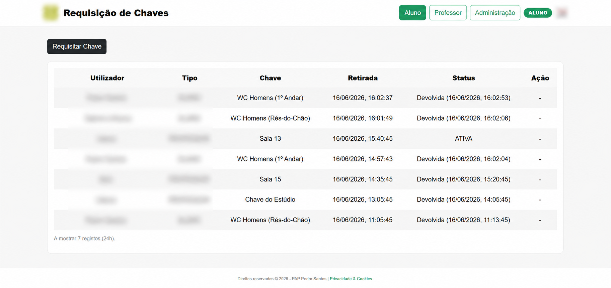
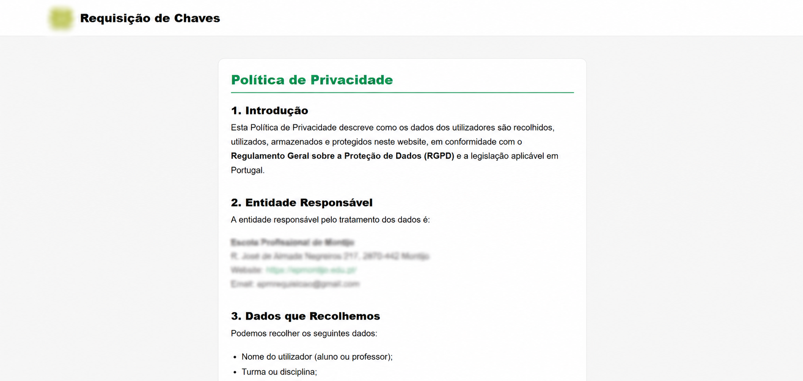

# Sistema de Requisição de Chaves

Sistema web para gestão e controlo de requisição de chaves numa escola profissional, desenvolvido como Prova de Aptidão Profissional (PAP).

## Autor
**Pedro Santos**
PAP — 2026

## Contexto

Na minha escola, o controlo de quem tinha cada chave era feito num caderno na receção. Quando alguém precisava de uma sala, ia ao caderno, escrevia o nome, hora e turma. Quando devolvia, voltava ao caderno para o registar. Tinha problemas óbvios:

- Difícil saber em tempo real que chaves estavam fora
- Esquecimentos no registo da devolução
- Letras ilegíveis e dados duplicados
- Impossível tirar relatórios por período
- Sem auditoria de quem fez o quê

O sistema substitui o caderno por uma plataforma web acessível por QR Code, com registo automático, controlo em tempo real e relatórios exportáveis.

## Descrição

Três tipos de utilizadores, cada um com fluxo próprio:

- **Aluno** — requisita pelo nome e número de telefone (verificação por apelido, sem necessidade de conta). Devolve introduzindo o mesmo número.
- **Professor** — entra com PIN partilhado, escolhe-se na lista e requisita.
- **Administrador** — gere utilizadores, chaves, backups, PIN dos professores e altera password com confirmação por email.

## Screenshots

### Dashboard


### Página de Privacidade e Cookies (RGPD)


## Tecnologias

- **Backend**: PHP 8.x + SQLite (PDO)
- **Frontend**: HTML5 + Bootstrap 5 + JavaScript vanilla (sem framework)
- **Email**: PHPMailer (SMTP Gmail)
- **Servidor**: Apache + .htaccess

## Funcionalidades

- Requisição e devolução de chaves em tempo real
- Dashboard com histórico filtrado por período (24h, 7d, 15d, 30d, 100d)
- Geração de QR Codes para cada chave (requisição direta por scan)
- Backups automáticos da BD a cada hora (retenção de 72h)
- Restauro de backup com preservação automática das credenciais e PIN
- Exportação de relatórios em TXT
- Autenticação com proteção brute-force (5 tentativas / 15 min de lockout)
- Alteração de password com confirmação por código de 6 dígitos por email
- Registo de auditoria de eventos sensíveis (`data/security-events.log`)
- Interface responsiva (telemóvel, tablet, computador)
- Página de privacidade e cookies (RGPD)
- Modo de emergência com sirene
- Cumprimento de RGPD via política dedicada e dados pessoais minimizados

## Esquema da base de dados

```
admin                users               chaves              requisicoes
─────                ─────               ──────              ───────────
id (PK)              id (PK)             id (PK)             id (PK)
email (UNIQUE)       nome                codigo              user_id ──► users.id
password_hash        tipo                nome                chave_id ──► chaves.id
created_at           turma               restricao           inicio
                     telefone                                fim
                     created_at                              estado (ATIVA|DEVOLVIDA)
                                                             telefone
settings                                                     ip_address
────────                                                     created_at
key (PK)
value                                    (UNIQUE index parcial em users.telefone WHERE tipo='ALUNO')
```

## Requisitos

- PHP 8.0+ com extensões:
  - `pdo_sqlite` (base de dados)
  - `openssl` (PHPMailer/STARTTLS)
  - `mbstring` (manipulação de strings UTF-8)
  - `iconv` (normalização de nomes com acentos)
- Apache com `mod_rewrite` e suporte a `.htaccess`
- Conta Gmail com **App Password** ativa (para envio de notificações por SMTP)

## Instalação

1. Colocar o projeto na pasta servida pelo Apache (`C:\xampp\htdocs\` no XAMPP, ou equivalente).
   - Se vier de Git: `git clone <url> requisicao`
   - Se vier de ZIP: extrair o ZIP para essa pasta.
2. (Opcional — só para emails) Editar `config.php` e preencher com a tua conta SMTP:  
   ```
   SMTP_USER  → o teu email
   SMTP_PASS  → App Password do Gmail (16 caracteres)
   ```
   Sem isto, o sistema funciona na mesma — apenas não envia notificações por email.
3. Garantir que a pasta `data/` tem permissões de escrita (Apache precisa disto para criar a base de dados SQLite).
4. Iniciar o Apache e abrir no browser:
   `http://localhost/<pasta-do-projeto>/html/index.html`
5. Clicar em **"Administração"** — na primeira utilização aparece um formulário para criares o email e palavra-passe do administrador único.

## Primeira utilização

A base de dados começa **sem nenhum administrador**. Ao abrir `html/admin-login.html` pela primeira vez, é apresentado um formulário para definires o **email** e a **palavra-passe** do administrador único. Depois disso, esse formulário deixa de aparecer e qualquer acesso ao painel admin passa pelo login normal.

| Conta | Como é definida |
|---|---|
| **Administrador** | Tu defines no primeiro acesso a `admin-login.html` |
| **PIN Professor** | Default `1111` — alterável no painel admin |

> ⚠️ **Altera o PIN dos professores** logo após o primeiro login (painel admin → secção "PIN de Professor").

## Estrutura de pastas

```
.
├── api.php                 # Backend único (dispatcher + 27 endpoints)
├── seed_alunos.php         # Importação inicial de alunos (Excel/Forms)
├── config.example.php      # Template das credenciais SMTP
├── assets/                 # Imagens, áudio, logótipo
├── css/                    # Estilos por página
├── data/                   # BD SQLite + backups + log (gitignored)
├── html/                   # Páginas: index, requisitar, devolver, admin, etc.
├── js/                     # api.js (cliente), app.js (UI), requisicao.js
└── vendor/phpmailer/       # Biblioteca PHPMailer
```

## Licença

MIT License — Copyright © 2026 Pedro Santos

Software livre. Podes usar, copiar, modificar e distribuir, comercialmente ou não, desde que mantenhas o aviso de copyright. Ver [LICENSE](LICENSE) para os detalhes.

Originalmente desenvolvido como Prova de Aptidão Profissional (PAP).
